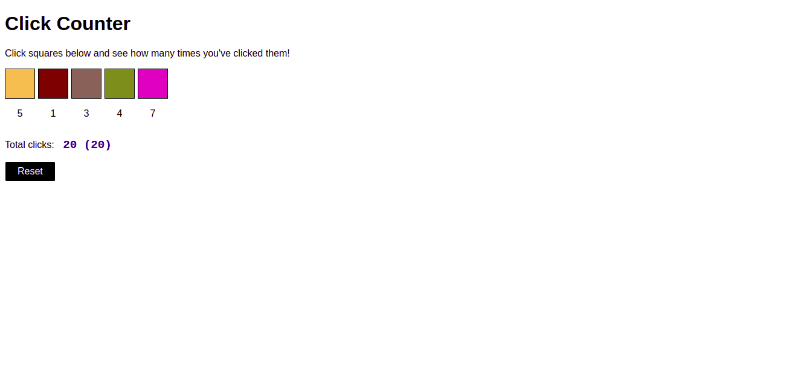

# Click Counter

Counts how many times colored squares were clicked by a user.

## Features

- counting how many times colored squares were clicked
- generating random color values

## Technologies used

- HTML
- CSS
- JavaScript

## Preview

Live demo: [click here](https://pawelpohland.github.io/click-counter/)

